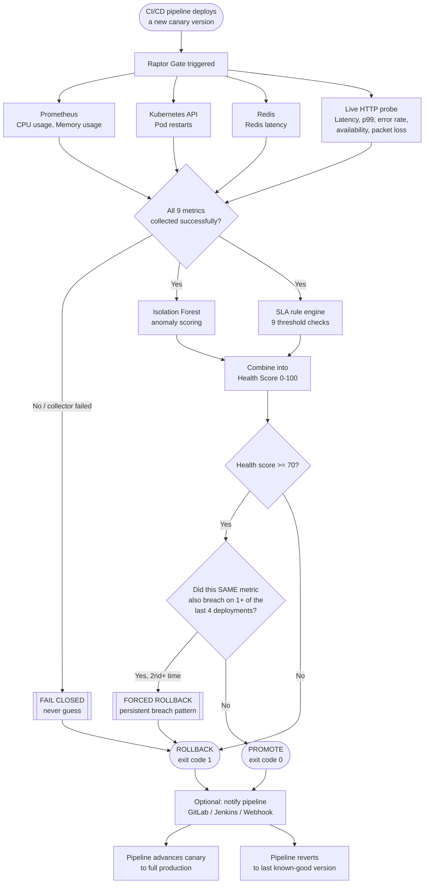

# Raptor Deployment Gate — Client Demonstration

**An automated, ML-driven canary deployment gate running live on Kubernetes**

---

## 1. What this is

The Raptor Deployment Gate is an automated quality gate for canary deployments.
Instead of a human watching dashboards and deciding "does this new version look
healthy enough to roll out fully," the gate makes that decision automatically —
in seconds, from real metrics, every time a deployment happens.

It combines three independent signals into a single decision:

- **Machine learning anomaly detection** (Isolation Forest) — trained on the
  service's own healthy history, it catches *subtle, cross-metric* degradation
  that no single fixed threshold would flag.
- **An explicit SLA rule engine** — 9 concrete thresholds (latency, error
  rate, CPU, memory, availability, etc.), each one directly traceable to a
  business requirement.
- **Cross-deployment pattern detection** — if the *same* metric breaks its
  SLA across multiple recent deployments, that is treated as proof of a real
  application problem and forces a rollback outright, even if any single
  deployment on its own might otherwise have looked acceptable.

The output is a single, unambiguous verdict: **PROMOTE** or **ROLLBACK** — with
full supporting evidence for *why*.

## 2. How it works, end to end



**Reading the flow:** every deployment triggers a fresh collection from all
four live sources. If any metric can't be reliably collected, the gate fails
closed straight to ROLLBACK — it never guesses. If the full sample is
collected, it's scored by **both** the Isolation Forest and the SLA rule
engine simultaneously, combined into one health score. Even if that score
clears the promotion bar, the gate takes one more look: has this exact metric
already broken its SLA on a recent prior deployment? If so, that pattern
overrides the score and forces a rollback — a single borderline-but-passing
deployment is not allowed to hide a metric that keeps recurring. The
resulting exit code (0 or 1) is what the CI/CD pipeline actually acts on —
automatically, with no manual approval step.

## 3. Where it's running right now

This isn't a slide-ware prototype. The gate is deployed and running live
inside the client's own Kubernetes cluster, where it:

- Pulls real-time metrics from **Prometheus** (CPU, memory)
- Pulls real-time pod health from the **Kubernetes API** (restart counts)
- Measures real-time cache performance against the live **Redis** instance
- Actively probes the live service over HTTP to measure latency, error rate,
  and availability exactly as a real caller would experience it

Every number shown in this document was captured from that live run — not
simulated.

## 4. The 9 metrics it monitors

| Metric | Source | SLA Threshold |
|---|---|---|
| CPU usage | Prometheus | ≤ 80% |
| Memory usage | Prometheus | ≤ 75% |
| Pod restarts | Kubernetes API | ≤ 3 |
| HTTP error rate | Live probe | ≤ 1% |
| p99 latency | Live probe | ≤ 200ms |
| Availability | Live probe | ≥ 99.5% |
| Redis latency | Redis | ≤ 10ms |
| Endpoint latency | Live probe | ≤ 200ms |
| Packet loss | Live probe | ≤ 1% |

## 5. The decision in action

### Case A — Healthy deployment → PROMOTE

A canary sample representative of a healthy, well-behaving service was scored
against the live system:

```json
{
  "decision": "PROMOTE",
  "health_score": 78.1,
  "anomaly_score": 78.1,
  "is_anomaly": true,
  "violations": [],
  "gate_threshold": 70
}
```

**Reading it:** zero SLA breaches, a health score comfortably above the
promotion threshold of 70. The gate's verdict: ship it. In a CI/CD pipeline,
this corresponds to **exit code 0** — the pipeline automatically proceeds to
full rollout, with zero manual approval steps and zero delay.

### Case B — Degraded deployment → ROLLBACK

The same engine, scoring a canary with real-world problems — elevated memory,
crash-looping pods, slow responses:

```json
{
  "decision": "ROLLBACK",
  "health_score": 0.0,
  "anomaly_score": 72.2,
  "violations": [
    "memory_usage=82.0% violates SLA (must be <= 75.0%)",
    "pod_restarts=4.0 violates SLA (must be <= 3.0)",
    "http_error_rate=2.8% violates SLA (must be <= 1.0%)",
    "p99_latency=380.0ms violates SLA (must be <= 200.0ms)",
    "availability=97.5% violates SLA (must be >= 99.5%)",
    "redis_latency=18.0ms violates SLA (must be <= 10.0ms)",
    "endpoint_latency=410.0ms violates SLA (must be <= 200.0ms)",
    "packet_loss=1.8% violates SLA (must be <= 1.0%)"
  ],
  "gate_threshold": 70
}
```

**Reading it:** 8 of 9 metrics in breach. Health score floors at 0. The gate's
verdict: do not ship it. **Exit code 1** — the pipeline automatically reverts
to the last known-good version. No incident, no 2am page, no customer impact.

### Case C — The same minor issue, twice in a row → forced ROLLBACK

Not every bad deployment looks dramatically broken. Sometimes a canary is
*almost* fine — one metric just over its limit, everything else healthy —
and on its own, that single deployment would reasonably PROMOTE. The problem
is when that exact same metric keeps doing it, release after release. The
gate catches that pattern specifically:

**First deployment** (one minor breach — Redis cache responding at 11ms
against a 10ms limit — otherwise a clean, healthy-looking canary):

```json
{
  "decision": "PROMOTE",
  "health_score": 70.0,
  "violations": [{"metric": "redis_latency", "value": 11.0, "threshold": 10.0}],
  "persistent_breaches": [],
  "forced_rollback": false
}
```

**Second deployment, same issue recurring:**

```json
{
  "decision": "ROLLBACK",
  "health_score": 70.0,
  "violations": [{"metric": "redis_latency", "value": 11.0, "threshold": 10.0}],
  "persistent_breaches": [{
    "metric": "redis_latency",
    "breach_count": 2,
    "detail": "redis_latency violated its SLA in 2 of the last 2 samples -- treated as a persistent application issue, forcing ROLLBACK regardless of this sample's health score."
  }],
  "forced_rollback": true
}
```

**Same health score both times — 70.0.** The difference is purely that this
is the *second* time this metric has broken its SLA for this service. The
gate treats that as proof of a real, standing problem and overrides the
score, rather than letting a borderline-but-technically-passing deployment
quietly repeat the same issue indefinitely.

## 6. Why this matters — the business case

| Without an automated gate | With the Raptor Gate |
|---|---|
| A human watches dashboards after every deploy and decides whether it's safe | The decision is automatic, consistent, and takes seconds |
| Judgment calls vary by who's on call and how tired they are | Every deployment is scored against the exact same rules and the exact same model, every time |
| Subtle cross-metric issues (e.g. memory *and* latency *and* error rate each slightly elevated) are easy to miss individually | The Isolation Forest is trained specifically to catch combinations no single threshold would flag |
| Bad deployments can sit in production for minutes or hours before anyone notices and rolls back | Rollback happens automatically, immediately, as part of the deployment pipeline itself |
| Rollout decisions aren't repeatable or auditable | Every decision ships with full supporting evidence — which metrics, which thresholds, which values — for audit and post-incident review |
| A minor, recurring issue can keep slipping through if each individual deployment looks "good enough" on its own | The gate remembers recent deployments per service and forces a rollback the moment the *same* metric breaks its SLA repeatedly — a pattern no single snapshot would catch |

## 7. Built-in safety model

- **Fails closed, never open.** If the gate cannot reliably collect metrics —
  a network blip, a missing credential, a down data source — it does **not**
  guess. It automatically returns ROLLBACK. The system is designed so that
  *uncertainty itself* is treated as a reason not to promote.
- **A recurring issue overrides a passing score.** If the same metric breaks
  its SLA across multiple recent deployments, the gate forces a rollback
  outright — see Case C above. One acceptable-looking deployment is never
  allowed to mask a pattern of the same problem repeating.
- **Notification failures never change the decision.** If the gate's optional
  integration with GitLab/Jenkins/a webhook fails to send, the deployment
  decision itself is unaffected — notification is additive, never a single
  point of failure for the core safety mechanism.
- **Secrets are never stored in config.** Credentials are read from the
  environment only; nothing sensitive is ever committed or hard-coded.

## 8. Fits into existing CI/CD, no rip-and-replace

The gate is a single command with a single, simple contract: it returns
**exit code 0 to promote, exit code 1 to roll back.** Any pipeline — GitLab
CI, Jenkins, or a custom script — can branch on that exit code directly, with
no proprietary pipeline platform required and no changes to how deployments
are already triggered.

It can also actively notify a pipeline via webhook, GitLab trigger, or
Jenkins job parameters the moment a decision is made — so downstream
automation reacts immediately, not on a polling delay.

## 9. Summary

The Raptor Deployment Gate turns "is this deployment safe to promote" from a
manual, inconsistent, delay-prone judgment call into an automatic, auditable,
sub-second decision — backed by machine learning, explicit business rules,
and cross-deployment pattern detection, running live against the client's
real infrastructure today.
